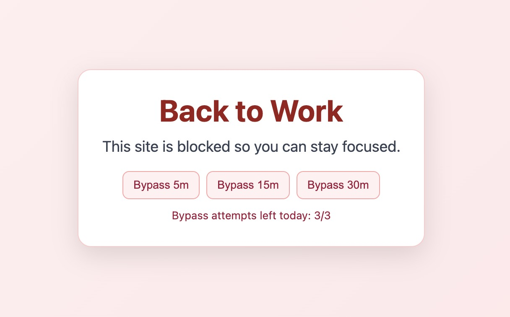

# btw (Back to Work)



Back to Work is a Chrome extension that blocks distracting websites so you can focus on work.

## Blocked Sites (Default)

- twitter.com
- x.com
- facebook.com
- reddit.com
- youtube.com
- instagram.com

## How to Use

1. Clone this repo:
   ```bash
   git clone https://github.com/rahilsh/btw
   ```
2. Open `chrome://extensions/` in Chrome.
3. Turn on **Developer mode** (top-right).
4. Click **Load unpacked** and select this `btw` folder.
5. Click the extension icon and use the popup controls:
   - **Blocking enabled**: distracting sites are covered by a focus overlay.
   - **Blocking paused**: sites open normally.
   - **Bypass 5m / 15m / 30m**: temporarily allow the current site hostname.
   - **Clear site bypass**: remove active temporary bypass for the current hostname.
6. On a blocked page, you can also click **Bypass 5m / 15m / 30m** directly on the overlay.

## Notes

- Blocking state is saved in `chrome.storage.local` under `btw_enabled`.
- Temporary bypass timestamps are stored under `btw_site_bypass_until`.
- Daily bypass attempt counters (max 3 per hostname per day) are stored under `btw_bypass_attempts`.
- Content script runs at `document_start` for faster blocking.
